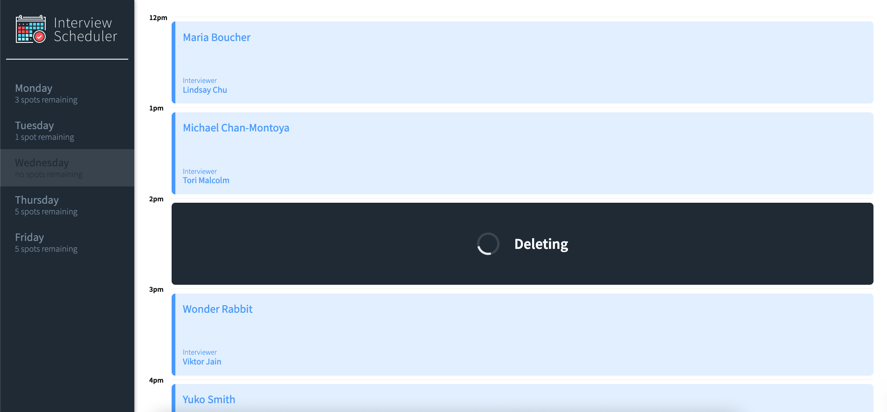

# Interview Scheduler

## WELCOME TO MY SCHEDULER APP
Interview Scheduler is a simple single-page application built to explore the REACT Toolkit.

## Features
1. Book Appointments
2. Delete Appointments with Confirmation
3. Reschedule Appointments
4. See Spots remaining for each Day
5. Optimistic UI
6. Responsive design !
7. No refresh/reload needed !

### Main


### Edit


### Confirm Delete


### Saving


### Deleting


## Getting Started
1. Fork this repository, then clone your fork of this repository.
2. Install dependencies using the `npm install` command.
3. [Clone Scheduler API](https://github.com/lighthouse-labs/scheduler-api)
4. Follow Scheduler API README for setup instructions

## Running Webpack Development Server

```sh
npm start
```

## Running Interview Scheduler API
 
   
```sh
npm start
```

## Running Jest Test Framework

```sh
npm test
```

## Running Storybook Visual Testbed

```sh
npm run storybook
```
